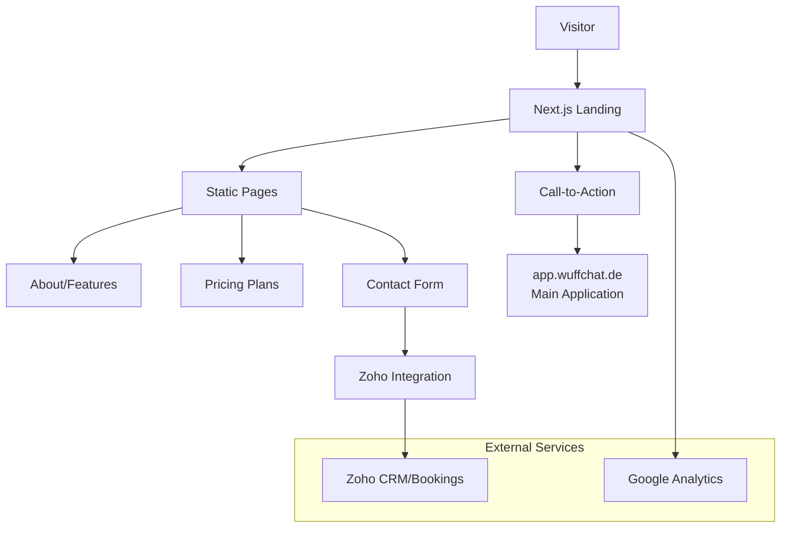

# WuffChat Landing Page

**Production**: Next.js marketing site | **Live**: wuffchat.de

Marketing website and landing page for WuffChat, featuring product information, pricing, and conversion flows to the main application.

## Technical Architecture



### Key Pages
- **Homepage**: Product overview and value proposition
- **Features**: Technical capabilities and AI features
- **Pricing**: Service tiers and consultation booking
- **About**: Company background and team information
- **Contact**: Lead generation and support inquiries

## Quick Start

```bash
# Install dependencies
npm install

# Configure environment
cp .env.local.template .env.local
# Edit with your service API keys

# Development server
npm run dev

# Production build
npm run build
npm run start
```

## Features & Integrations

### Marketing Conversion Flow
1. **Problem Awareness**: Emotional connection through dog behavior challenges
2. **Solution Presentation**: AI-powered conversation with Balu (dog perspective)
3. **Value Demonstration**: Free behavioral insights and analysis
4. **Lead Capture**: Email collection for follow-up resources
5. **Premium Conversion**: 60-minute consultation booking (€69)

### Technical Integrations
- **Zoho CRM**: Lead management and customer data
- **Zoho Bookings**: Consultation scheduling system
- **Stripe Checkout**: Payment processing for consultations
- **Email Automation**: Follow-up sequences and resource delivery
- **Google Analytics**: Traffic analysis and conversion tracking

### Performance Optimizations
- **Static Generation**: Pre-rendered pages for fast loading
- **Image Optimization**: Next.js automatic image optimization
- **SEO Optimization**: Meta tags, structured data, sitemap
- **Mobile First**: Responsive design optimized for mobile users

## Content Management

### Localization
- **Primary Language**: German (target market)
- **Content Structure**: Modular components for easy updates
- **SEO Content**: Optimized for dog behavior and training keywords

### A/B Testing Ready
- **Conversion Elements**: Headline, CTA buttons, pricing presentation
- **Analytics Integration**: Event tracking for user interactions
- **Performance Monitoring**: Core Web Vitals and conversion metrics

## Deployment

### Production Stack
- **Platform**: Vercel/Netlify (static deployment)
- **Domain**: wuffchat.de with SSL
- **CDN**: Global content delivery network
- **Monitoring**: Uptime and performance tracking

### Environment Variables
```bash
NEXT_PUBLIC_APP_URL=https://app.wuffchat.de
ZOHO_API_KEY=your-zoho-api-key
GOOGLE_ANALYTICS_ID=GA-measurement-id
STRIPE_PUBLIC_KEY=pk_live_...
```

## Development Tools

```bash
# Available scripts
npm run dev          # Development server
npm run build        # Production build
npm run start        # Production server
npm run lint         # ESLint checking
npm run analyze      # Bundle analysis
```

### Code Quality
- **TypeScript**: Type-safe development
- **ESLint/Prettier**: Code formatting and linting
- **Lighthouse**: Performance and accessibility auditing

---

**Back to WuffChat meta-repository** - see [wuffchat](https://github.com/kemperfekt/wuffchat) for complete overview